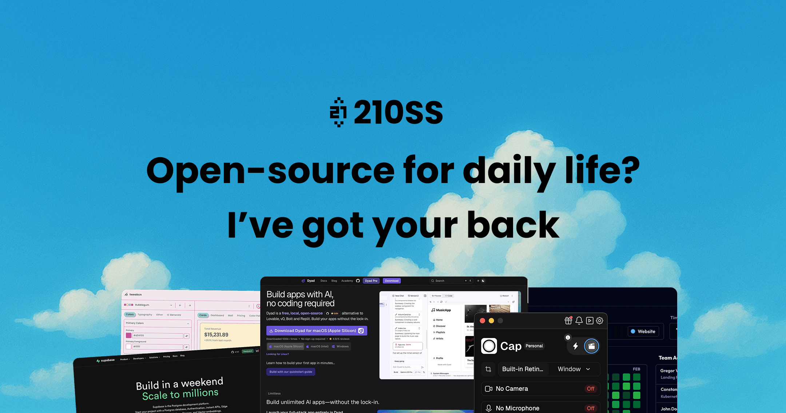

# 🚀 Welcome to 21OSS.com!

**[21OSS.com](https://21oss.com)** is an open-source resource hub for developers and creators.  
It curates **templates, components, tools, and assets** that help you move faster—from idea to shipped product.

No noise. No fluff. Just practical, open-source resources that actually ship.

---

## 🌟 Why I Built This

I’ve always believed open-source is one of the most powerful forces in tech.  
But discovering good open-source resources is still harder than it should be.

Great templates are buried in repos.  
Useful components are scattered across tweets and blog posts.  
Assets live everywhere—with no context, no curation, and no clear starting point.

I built **21OSS** to solve that problem.

This is a place where developers, designers, and makers can:
- Discover high-quality open-source resources
- Understand what’s actually useful in real projects
- Spend less time searching and more time building

It’s not about collecting everything.  
It’s about curating what works.

**If this helps someone ship faster, learn better, or avoid decision fatigue—even once—then this project has done its job.**

---

## 🏗 Architecture

The project uses a modern stack:

- **Frontend**: Next.js 15
- **Database**: Supabase 
- **Authentication**: Better Auth
- **Storage**: AWS S3
- **ORM** : Prisma

--- 

## Project Structure

21OSS is built in Next.js App Router. The project structure is organized as follows:

- `/app` - Application routes and layouts (Next.js App Router)
- `/components` - Reusable React components
- `/lib` - Core utilities and business logic
- `/actions` - Server actions
- `/utils` - Helper functions and utilities
- `/hooks` - React hooks
- `/contexts` - React context providers
- `/services` - Service integrations
- `/emails` - Email templates
- `/server` - Server-side code
- `/config` - Configuration files
- `/prisma` - Prisma schema and utilities
- `/types` - TypeScript type definitions
- `/public` - Static assets

--- 

## License

21OSS is licensed under the [GPL-3.0 License](LICENSE).
